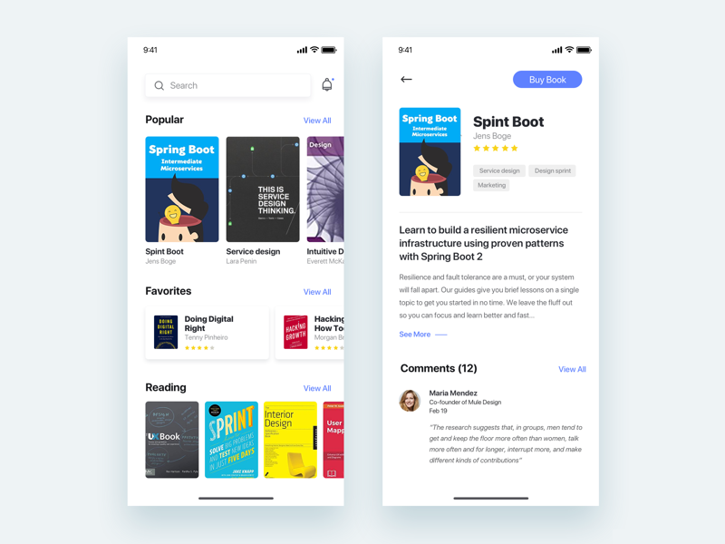

# flutter-sample

Repository for flutter UI samples. Please create an issue or make a PR if you need me try any design (in Flutter)

## Samples

1.  Learn new thing
    UI: https://dribbble.com/shots/4417198-App-for-learn-new-things-about-UX-Daily-UI-Challenge?fbclid=IwAR1tjyvoOqWGFdTGQNP3wn0pdUVFM2LaSRN2v_1ukLoFo2yjBnxNl593xIM

    Image:
    

## License
